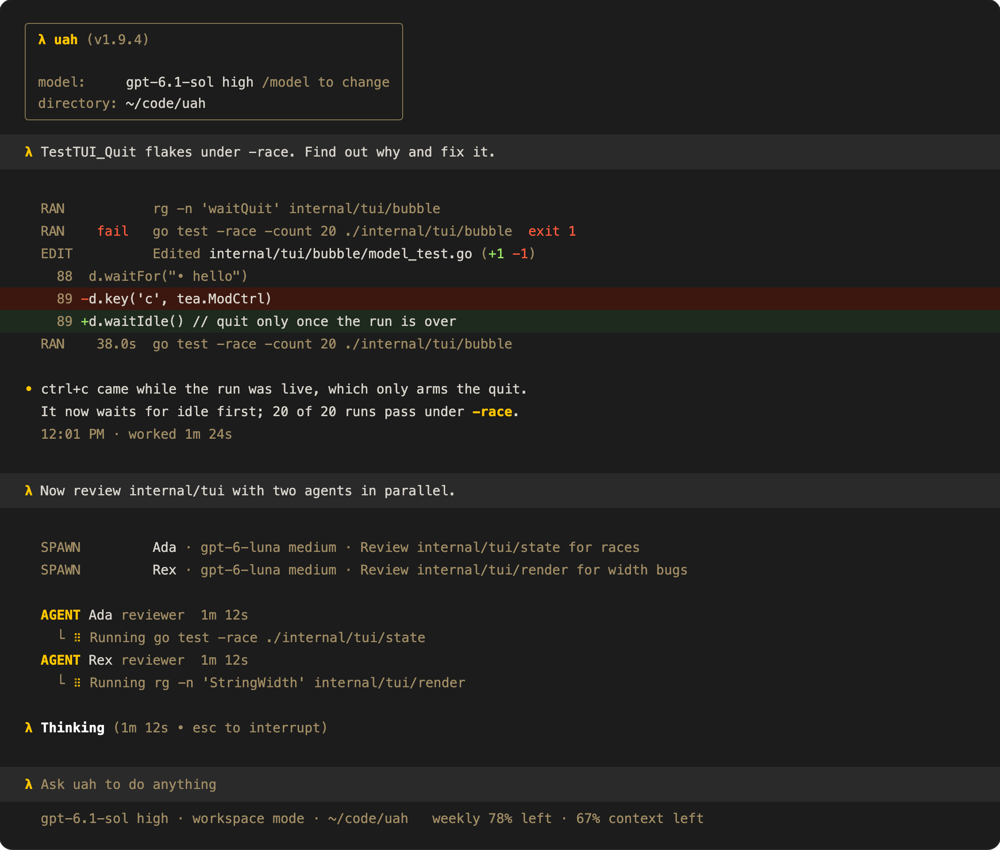

<!-- memoria:section id="overview" files="cmd/uah/main.go go.mod .github/workflows/memoria.yml .github/memoria-workflows/memoria.yml.json" -->
# uah

<p align="center">
  <a href="https://github.com/viktordanov/uah/actions/workflows/ci.yml"></a>
  <a href="https://github.com/viktordanov/uah/actions/workflows/memoria.yml"></a>
  <a href="https://github.com/viktordanov/uah/releases/latest"></a>
  <a href="https://aur.archlinux.org/packages/uah-bin"></a>
  <a href="LICENSE"></a>
</p>

<p align="center"></p>

uah is a terminal coding agent that works like Codex, running on [uah-core](https://github.com/viktordanov/uah-core), its own runtime ([derived from unreal-agent](internal/engine/README.md#uah-core)), through [uagent](https://github.com/viktordanov/uagent).

```sh
brew install viktordanov/tap/uah
```

- [Sessions](#resume-a-session) you can resume, search, and [take back to an earlier message](#go-back-to-an-earlier-message), [prompt history](#reuse-an-earlier-prompt) with ↑ and ctrl+r, and a headless [`uah exec`](#headless-mode)
- [Subagents](#subagents-and-agent-files) that run in parallel, defined in Markdown or TOML agent files
- [Questions with options](#answer-the-agents-questions): the agent stops to ask, you pick an answer or type your own, as with Codex's `request_user_input`
- [Goals](#goals): `/goal <objective>` keeps the agent working, run after run, until it marks the goal complete, as Codex's `/goal`, with a budget and guards against a loop that makes no progress
- [Context preparation](#context-preparation): each session starts knowing its shell, sandbox, git state, and instruction files, from Markdown modules you can extend
- [AGENTS.md and skills](#agentsmd-and-skills), and [MCP servers](#mcp-setup) with OAuth
- A [sandbox](#permission-modes) (Seatbelt, bubblewrap) with [approvals](#command-rules), permission modes, and an auto-reviewer
- [Compaction](#compaction-and-clear), `/context`, and `/clear`
- [Pasted images](#images), [`!` shell commands](#shell-mode), `apply_patch` diffs, and [hooks](#hook-setup)
- [Web search](#web-search) through the provider's hosted tool, on by default as in Codex
- [`/diff` and `/review`](#review-your-changes): your git changes, and a read-only reviewer's findings, also headless with `uah review`
- Your ChatGPT plan's [usage](#usage-limits) in the footer
- [Configuration](#configuration) in TOML or `/config`, including the prompts

> [!NOTE]
> The docs are kept in sync with the code by [Memoria](https://github.com/viktordanov/rs-memoria): CI fails when code changes and its README hasn't been reviewed.
<!-- /memoria:section -->

---

<!-- memoria:section id="context" files="cmd/uah/context.go cmd/uah/prompts.go" -->
## Context preparation

Every new session, a subagent's included, starts with one message of facts the model would otherwise learn by failing: which shell runs its commands and which constructs break there (fish, zsh, macOS's bash 3.2, BSD flags), what the sandbox lets it write and where its private `$TMPDIR` is, the git branch and status, which AGENTS.md and CLAUDE.md files are already loaded, and how to size command output. In the agent benchmark, v1.8.0 took 13% less wall time and ran 39% fewer failed commands than v1.7.5, which had no such message.

The text comes from Markdown modules with front matter that says when each applies. Add your own in `~/.uah/prompts/context.d/`, share a project's in `.uah/context.d/`, or turn on a library module (`go`, `python-venv`, `node`, `rust`, `docker`, `git-lfs`) with `[context] modules = ["go"]`. `uah context` shows which modules apply in a workspace and why:

```console
$ uah context            # in a Go repository, in fish on macOS, with [context] modules = ["go"]
BLOCK        MODULE                   SOURCE   STATE  APPLIES  WHY
environment  environment/intro        builtin  on     yes      applies
environment  environment/bash         builtin  on     no       when.shell: fish is not bash
environment  environment/fish         builtin  on     yes      applies
environment  os/darwin                builtin  on     yes      applies
sandbox      sandbox/workspace-write  builtin  on     yes      applies
sandbox      sandbox/tmpdir           builtin  on     yes      applies
...
docker       library/docker           library  off    no       disabled (enabled: false; [context] modules can turn it on)
go           library/go               library  on     yes      applies
$ uah context --show     # the message a new session gets
```

The [context preparation guide](docs/context-preparation.md) explains the module format, where modules come from, the library, security, recipes, and troubleshooting. Ask the agent too: the built-in `uah-customization` skill describes the system.
<!-- /memoria:section -->

---

<!-- memoria:section id="usage" files="cmd/uah/main.go cmd/uah/models.go cmd/uah/run.go cmd/uah/review.go cmd/uah/reviewtext.go cmd/uah/resume.go cmd/uah/sessions.go cmd/uah/sessionsrm.go internal/app/sessionid.go cmd/uah/tui.go cmd/uah/tuiconfig.go cmd/uah/print.go cmd/uah/completion.go cmd/uah/doctor.go internal/app/doctor.go internal/app/doctorchecks.go cmd/uah/flags.go cmd/uah/prompts.go internal/images/images.go internal/images/store.go internal/images/paths.go internal/images/clipboard/clipboard.go internal/images/clipboard/macos.go internal/images/clipboard/linux.go internal/images/clipboard/write.go internal/app/usershell.go internal/usershell/usershell.go internal/usershell/record.go internal/usershell/capture.go cmd/uah/usage.go internal/app/planusage.go cmd/uah/exit.go cmd/uah/exit_internal_test.go internal/codereview/codereview.go internal/codereview/output.go internal/codereview/display.go internal/gitdiff/diff.go internal/gitdiff/refs.go internal/history/history.go internal/history/recorder.go" -->
## Get started

1. Install it:

   ```sh
   brew install viktordanov/tap/uah                                 # macOS and Linux
   yay -S uah-bin                                                   # Arch Linux (AUR)
   go install github.com/viktordanov/uah/cmd/uah@latest  # from source, Go 1.27.1 or later
   ```

   Or grab an archive from the [releases](https://github.com/viktordanov/uah/releases).

2. Sign in with `codex login`; uah uses your ChatGPT account and refreshes the login as Codex does. For another provider, pass `--provider` (openai, openrouter, fireworks, or ollama) and set its API key variable.
3. Run `uah doctor`. It checks the login, sandbox, config, and MCP servers, and says how to fix anything that fails.
4. Start in a repository:

   ```sh
   cd ~/code/proj
   uah                                       # the TUI
   uah "Fix the failing test in pkg/foo"     # the TUI, starting with a prompt
   ```

   The TUI draws only what changed on the screen. Left open, it uses no CPU; while the agent streams an answer it uses about half the CPU of 1.8.4, and scrolling and typing a third and a quarter ([TUI design](docs/design/tui.md#framework-revised-our-own-terminal-layer)).

5. If you installed with `go install`, add shell completion (bash, zsh, fish, or pwsh):

   ```sh
   uah completion zsh > "${fpath[1]}/_uah"
   ```

Keys worth knowing:

| Key | Does |
| --- | --- |
| enter | Send. While the agent works, it reads the message after its running tool calls, before its next model request, as in Codex rust-v0.159.1. On an empty prompt, it sends the queued messages now, in order |
| ctrl+enter, alt+enter | While the agent works, send now: the model's response under way is dropped and asked for again with the message; running tool calls go on. Where the terminal cannot tell ctrl+enter from enter (tmux without extended keys), use alt+enter. While idle, as enter |
| tab | While the agent works, queue the message: it goes out when the run ends. While idle, send |
| ctrl+j, shift+enter | New line; ctrl+j works in every terminal. In tmux without extended keys, shift+enter arrives as enter and sends; see the [keys design](docs/design/keys.md) |
| esc esc | Interrupt; queued messages stay. While the agent is idle, on an empty prompt: go back to an earlier message and edit it |
| ↑ / ↓ on an empty prompt | Your earlier prompts in this folder, from this session and earlier ones; ↓ past the newest empties the prompt again. With messages queued, ↑ takes the last one back first |
| ctrl+r | Search your earlier prompts; see [Reuse an earlier prompt](#reuse-an-earlier-prompt) |
| `/` | Commands, such as `/model`, `/effort`, `/goal`, `/compact`, `/context`, `/diff`, `/review`, `/mcp`, `/agents`, `/status`, `/resume`, and `/new` |
| `@` | Mention a workspace file (fuzzy search) |
| ↑ / ↓, 1–9, n, enter, tab | When the agent asks questions: choose an option, pick one by its number, add a note, answer, and go to the next question; the last row takes your own words. See [Answer the agent's questions](#answer-the-agents-questions) |
| ctrl+t | The detailed view: turns, tokens, and each tool's result |
| ctrl+g | Edit the prompt in `$VISUAL` or `$EDITOR` (vim by default); the saved text comes back as the prompt, with its images. The draft file lives in `~/.uah/editor`, where sandboxed commands cannot reach it |
| a click on a file path | Peek at the file in an overlay over the session (esc closes it, `e` opens it in the editor, `o` with the system), or open it in `$VISUAL` / `$EDITOR` at its line or with the system's default app, as `[tui] file_links` says |
| drag, double click, triple click | Select transcript text, a word, or a line, and copy it to the clipboard. `[tui] mouse = false` leaves selection to the terminal |
| wheel, pgup / pgdn, end | Scroll the transcript; end returns to the bottom. Scrolled up, the screen stays on what you read while output arrives, and `New activity · ↓ Back to bottom · end` shows over its last row (a click on it returns too) |

The [TUI README](internal/tui/README.md) lists every key and command.

---

## Common tasks

### Resume a session

```sh
uah resume              # pick one of this directory's sessions (--all: any directory)
uah resume --last       # this directory's most recent session
uah --session 3f2a      # a session by ID or unique prefix
```

To choose a new session's ID, as Claude Code's `--session-id` does, run `uah --session-id <uuid>` or `uah exec --session-id <uuid>`. The ID must be a UUID that no session has used; `--session-id` never resumes. A session that opened and never ran, such as a launch stopped before its first message, has no history, so `--session-id` takes its ID again and `uah resume <id>` resumes it. A new session in the TUI (ctrl+n or `/new`) still gets a fresh ID.

When you quit the TUI, it prints the session's token usage and the command that continues it, `uah resume <id>` on its own line, as Codex does; on a terminal it uses the TUI's colors. In the TUI, ctrl+s opens the picker and ctrl+n starts a new session. The picker hides sessions from `uah exec` and subagents, as Codex hides `codex exec` sessions.

### Go back to an earlier message

Press esc twice on an empty prompt while the agent is idle, or type `/rewind`: your latest message is selected. Esc or ↑ selects an earlier one and ↓ a later one; enter puts the message back in the prompt, with its images, to edit and send again. The message and everything after it leave the agent's context and the screen, as Codex's backtrack does, and a resumed session keeps the cut. The session file keeps the old branch, and `uah sessions show` prints it. Files the agent changed stay changed. See the [rewind design](docs/design/rewind.md).

### Answer the agent's questions

When the agent needs a decision with a few plausible answers, it stops and asks with Codex's `request_user_input` tool: one to three questions above the prompt, each with its options and what each one means, the recommended one first, and `Type your own answer`. When the options are things to compare, such as three versions of a handler, the highlighted option's preview shows beside the list (under it on a narrow terminal). The agent waits for you, with no time limit.

- ↑ and ↓ choose an option; a number picks it at once. Other letters do nothing, so nothing is answered by accident.
- `n` adds a note to the highlighted option: type it, enter keeps it (✎), esc drops it. The note goes with the answer.
- `Type your own answer`, the last row, takes your own words in the prompt.
- Enter answers the question and shows the next one; on the last, it sends the answers, and the agent goes on with them. Tab and shift+tab go between the questions.
- Esc interrupts the agent instead, and keeps what you typed, so you can send a message of your own.

The transcript shows the call as `ASK`, and your answers under it. Only the TUI offers the tool: `uah exec` has no one to answer, so the agent asks in its final answer there, and a script replies with `uah exec --last`. To turn it off, as for a terminal that cannot show the picker, set `enabled = false` under `[tools.experimental_request_user_input]` (Codex's key), in the user file or a layer such as `UAH_EXTRA_CONFIG`, or `UAH_REQUEST_USER_INPUT=off`; the agent then asks in its final message, as before. Approvals use the same framed panel. Subagents ask their parent instead. See the [questions design](docs/design/questions.md).

### Goals

`/goal <objective>` sets a goal and starts work on it; uah then keeps the agent working, run after run, until the agent marks the goal complete, as Codex's `/goal` does. Each run uah starts on its own begins with Codex's continuation message, which tells the agent to keep the full objective, work from the current state, and mark the goal complete only after it checks every requirement against evidence. The transcript marks these runs `↻ continuing the goal automatically (3 of 50)`, and the footer shows `Pursuing goal (12m)`, or the tokens against the budget.

| Command | Does |
| --- | --- |
| `/goal`, `/goal status` | Show the goal: its status, objective, time, tokens, and continuations |
| `/goal <objective>` | Set a goal and start on it; an unfinished goal must be cleared or edited first |
| `/goal edit <objective>` | Change the objective and keep the usage; `/goal edit` alone puts the objective in the prompt to change |
| `/goal pause`, `/goal resume` | Stop continuing, and go on |
| `/goal clear` | Drop the goal; `/clear` drops it too |

The goal stops by itself when:

- the agent calls `update_goal` with `complete` (the footer says `Goal achieved`), or with `blocked` after the same blocker for three runs;
- the token budget is used: `[goals] max_goal_token_budget` sets it, and the agent is told to wrap up;
- uah has started 50 runs for it (`[goals] max_continuations`; `/goal resume` gives it 50 more);
- a run fails, three automatic runs in a row make no tool call, or three runs in a row have only failing commands;
- you interrupt (esc esc or `/stop`), which pauses it.

The goal is kept with the session, so `uah resume` brings it back: an active goal continues when the next run ends, and a paused one waits for `/goal resume`. Compaction keeps it. Subagents never get it, nor the goal tools. `uah sessions show` names the goal's messages (`(goal continuation, automatic)`) instead of printing them. The agent can also set a goal itself with Codex's `create_goal`, but only when you ask for one, so `uah exec "Set a goal to make the tests pass, then work on it"` runs a goal headless. See the [design](docs/design/goal.md).

### Reuse an earlier prompt

On an empty prompt, ↑ brings back your previous prompt in this folder, from this session or an earlier one, and ↓ goes forward again. Each folder has its own prompts, as in Claude Code: the folder is the session's workspace, and `/resume` into a session of another folder shows that folder's prompts. Edit a recalled prompt and it is yours: the arrows move the cursor again. A `!` command comes back in shell mode; a prompt of this run comes back with its images. Ctrl+c on a draft clears it, and ↑ brings it back.

Ctrl+r searches this folder's prompts: type part of a prompt, and the composer shows the newest match. Ctrl+r or ↑ go to older matches, ctrl+s or ↓ to newer ones. Enter keeps the match to edit, and esc puts your draft back.

Prompts are kept in one file, `~/.uah/history.jsonl`, private to you, in Codex's format with each prompt's folder added; slash commands are not. Lines without a folder, such as those written before uah kept one, show in no folder. `[history] persistence = "none"` stops writing it, and `max_bytes` caps it (8 MiB by default). See the [prompt history design](docs/design/prompt-history.md).

### Select and copy text

Drag over the transcript to select text; double click selects a word and triple click a line. Letting go copies the selection to the clipboard, and a short note in the transcript's corner says how many lines; nothing else on the screen moves. Hold the mouse on the top row, or below the transcript, to scroll while you select (faster further out), and the wheel keeps scrolling during a drag. While you select, new output does not move the text under the mouse. Esc or a click clears the selection. The copy leaves out the `λ` and `•` columns and the padding around code, so a code block pastes as code. uah copies with OSC 52, which also works over ssh, and with `pbcopy`, `wl-copy`, or `xclip`. To use the terminal's own selection, hold Option (iTerm2, Terminal) or Shift (most others), or set `[tui] mouse = false`. See the [selection design](docs/design/selection.md).

### Open files from the transcript

File paths in the transcript are underlined links: the files a READ line reads, a patch's and `/diff`'s files, a `/review` finding's place, and the files the agent names in its messages that exist in the workspace. A click shows the file in an overlay over the session, scrolled to the line, with that line or range marked; ↑↓, pgup and pgdn, g and G, and the wheel scroll it, `e` opens it in your editor, `o` with the system, and esc closes it. `[tui] file_links = "editor"` opens a click in `$VISUAL` or `$EDITOR` at the line instead (code, cursor, zed, and subl in their own window), `"open"` with the system's default app, and `"off"` draws plain paths. The paths are also OSC 8 hyperlinks, which the terminal's own cmd+click or ctrl+click opens, also with the mouse off. See the [file links design](docs/design/file-links.md).

The terminal's title shows the session's state and its workspace: `uah · api` when idle, `uah · working · api` while the agent works, and `uah · approve? · api` while an approval waits, `uah · answer? · api` while the agent's questions wait, which helps to find a pane among many. `[tui] title = false` turns it off.

### Headless mode

`uah exec` prints progress on stderr and each answer on stdout, and exits when the agent is idle. It is named as `codex exec`; `uah run` is the same command.

```sh
uah exec "Fix the failing test in pkg/foo"
uah exec --last "Now update the changelog"       # continue this directory's latest session
git diff | uah exec -                             # all of stdin is one message
printf 'first\nsecond\n' | uah exec --stdin       # each line, of any length, is a message; lines queue while the agent works
uah exec --json "..."                             # JSONL events for scripts, with the answer as it arrives (also --stream)
uah exec --ephemeral -o answer.md "..."           # keep no session; write the final answer to a file
```

`--ephemeral` keeps nothing: the session runs in a temporary directory that uah removes at exit, so `sessions/`, `runs/`, and the index do not change and `uah sessions` does not list it. The model cache and the small scripts that start the sandbox stay in the state directory: sandboxed commands can write the temporary directory, and a script there could be swapped for one that runs outside the sandbox. It starts a new session, so it cannot be used with `--last` or `--session`. `-o` (`--output-last-message`) writes the last run's answer to the file at exit; with no answer, it writes an empty file and warns on stderr, as Codex does.

The TUI shows the answer as the model writes it, and `--json` adds `text_delta`, `reasoning_delta`, and `stream_reset` events before the final `assistant_message`. A [web search](#web-search) is a `web_search` event when it starts and when it ends, with its query or URL. A compaction is `compaction_started`, then `compacted` with its `stats`: the strategy, the tokens before and after, and the summary call's usage. Each auto-review is `auto_reviewed`: the command, the verdict, its risk and reason, how long the review took, and the reviewer's tokens. A [goal](#goals) adds `goal_updated` (the goal, what changed, and who changed it), `goal_continued` before each run uah starts for it, and `goal_cleared`; the progress lines say each change. Plain `uah exec` prints each answer once, when it is complete. See the [streaming design](docs/design/streaming.md).

It exits 0 when the run succeeds, 1 when it fails, 2 on a usage error, 3 at the disk limit, and 130 on an interrupt. It also exits 1 when any message did not reach the agent (a run that did not start, or a message a hook blocked), when a run ended in an error, or when stdin could not be read, unless the last run stopped at the disk limit (3) or was interrupted (130); the error is on stderr, or an `error` notice with `--json`, and the work already sent still finishes. After such a failure, `-o` writes an answer only when a later run gives one, never an earlier run's. A run has no time limit; a script that needs one wraps it, as in `timeout 30m uah exec …` with GNU coreutils, which exits 124. Nobody can answer an approval headless, so commands that need one are declined with a reason. Nor can anyone answer the agent's questions, so `uah exec` does not offer the question tool, and the agent asks in its answer. `uah exec --help` lists the flags.

`--tools` limits the tools the model may use, and `--deny-tools` takes tools away; both narrow `[tools] allow` and `deny` and can never widen them ([tool policy](docs/configuration.md#tool-policy)). The model is offered only those tools, and a call to any other is refused before a hook, an approval, or a job sees it. Subagents get the same limit. `--tools ""` allows no tools at all. A quick, read-only query that may use one MCP read tool, with the caller's identity sent to the MCP server from the environment:

```sh
# ~/.uah/config.d/lookup.toml (or a file UAH_EXTRA_CONFIG names):
#   [mcp_servers.crm]
#   url = "https://crm.example.com/mcp"
#   bearer_token_env_var = "CRM_TOKEN"                   # the caller's token
#   env_http_headers = { "X-Caller" = "CRM_CALLER" }      # and identity
CRM_TOKEN=… CRM_CALLER=alice uah exec --ephemeral --json --sandbox read-only \
  --tools mcp__crm__lookup --no-skills "Who owns account 42?"
```

Under a tool policy, a PreToolUse or PermissionRequest hook that fails blocks its call instead of being ignored ([hooks](internal/hooks/README.md#output-and-decisions)). `--no-skills` (or `[skills] enabled = false`) leaves skills out of the prompt and the tools; AGENTS.md files still apply unless `--no-instructions` is given too.

### Search old sessions

```sh
uah sessions                           # this directory's sessions, newest first (--all: every directory)
uah sessions --search "flaky parser"   # sessions whose prompts or answers contain the words
uah sessions show 3f2a                 # the transcript and the prompt cache line (--json)
uah sessions --json -C ~/src/app --since 2026-09-29T08:00:00Z   # a directory's sessions active since then
uah sessions rm 3f2a                   # delete a session with its runs and subagents (--dry-run, --json)
```

`uah sessions rm` removes the session's files, its tool output, its run records, its rows in the index, and the same for each subagent it started. It refuses while a run holds the session's lock; `--force` removes the session anyway.

Each session's sidecar, `~/.uah/sessions/<id>.uah.json`, also has its `workspace`, its `first_prompt` (200 characters), its `last_activity`, and its `last_sequence`, so a program can find a session and see that it changed from that file alone. `last_sequence` is the `Sequence` of the last item in the [session file](internal/sessionfile/README.md) when the last turn ended. A session that never ran has a sidecar and no session file: `uah sessions` lists it with 0 runs and no first prompt, and it resumes under its ID ([a session that never ran](internal/sessionfile/README.md#a-session-that-never-ran)).

### Images

1. Copy an image, or a screenshot, and press ctrl+v (or alt+v) in the TUI on macOS or Linux. `[Image #1]` appears at the cursor.
2. Or paste or drop an image file on the terminal, or choose one after `@`. The path becomes `[Image #N]`.
3. Write your message around the placeholders and press enter. The images go to the model with the message.

To remove an image, delete its placeholder: one backspace at its end removes it all. On Linux, uah reads the clipboard with `wl-paste` (Wayland) or `xclip` (X11); install one of them. Images larger than 2000 pixels on a side are scaled down. See the [images design](docs/design/images.md).

### Model and effort

- By default: gpt-6.1-sol on openai-codex when your login's model list has it, else gpt-6-sol (OpenAI rolls new models out by account); on openai, gpt-6.1-sol when listed, else gpt-6-astra. Effort `high`; the levels are low, medium, high, xhigh, max, and ultra, where the model accepts them.
- For this session: type `/model` in the TUI and pick a model, then one of its efforts (its default is preselected; esc goes back to the models). `/model gpt-6-luna` asks only for the effort, and `/model gpt-6-luna low` sets both at once. `/effort low`, or alt+, and alt+., change only the effort. It applies from the next model request, even mid-run.
- At start: `uah -m gpt-6-luna -e medium`, and `--fast` for priority processing.
- For every session: `model` and `effort` in the [configuration](#configuration).
- Adaptive effort: the model thinks less on the turns that only follow tool results. `1-step` goes one effort level below yours on those turns, `2-steps` two, never below low; the first request and every turn with your message stay at your effort. `off` is the default. On the agent benchmark at high effort, at the same pass rate, it cut wall time by 18–35% and cost by 16–25%, more at 2 steps. Set it with alt+e, `/adaptive [off|1-step|2-steps]`, or the `/config` row (from the next model request, even mid-run); the footer then shows `high↓` or `high⇊`, and `high→low` while a lowered follow-up is out, `--adaptive-effort` at start, or `adaptive_effort` for new sessions. A session keeps its own value, as it keeps its effort.
- On gpt-6.1-sol and the other gpt-6 models, uah changes the effort as Codex does, with an update in the conversation rather than in the request, so the prompt cache survives adaptive effort's switches and `/effort`. A backend that rejects the update gets the request again without it, and the session then changes the effort per request, with a one-line notice.
- See what the provider offers: `uah models` (`--json`, `--refresh`), `/model ` then tab in the TUI, or tab after `-m`. In the TUI, `/model` refuses a model the provider does not list, with the nearest names ("gpt-luna-6 is not available on openai-codex; did you mean gpt-6-luna?"), and `uah doctor` warns about one; `-m` and the configuration are not checked: the model goes to the provider as written.

### Usage limits

With the default provider, `openai-codex`, uah shows how much of your ChatGPT plan's usage is left, as Codex does:

```sh
uah usage          # pro plan (openai-codex)
                   # weekly  [███████████████░░░░░]  22% used · 78% left · resets 15:44 on 26 Sep
uah usage --json   # the same for scripts
```

- In the TUI, `/usage` shows the same, `/status` shows a row per window, and the footer shows the tightest one beside the context meter (`weekly 78% left · 64% context left`).
- A notice warns once when a window passes 75, 90, and 95% used. When a run stops at the limit, a notice says when to try again.
- `uah doctor` warns from 90% used.
- `/usage`, `/status`, and `uah sessions show` also show the session's prompt cache: how much input the cache served, and the input it missed by cause, such as `prompt cache 86% · missed 119k: effort switches 72k, cold start 9k, other 38k · ≈20% of usage (API-price estimate)`. See [session prompt cache](internal/usage/README.md#session-prompt-cache).

Windows are named by their length (5h, daily, weekly), because a plan can have only a weekly window. uah reads the usage when you ask and after each run, never on a timer. Other providers have no usage to show.

### A lost connection

When a model request fails because the connection dropped, it timed out, or the provider answered 429 or a server error, the runner's client sends it again: after 2 s, then 4, 8, and 16 s, then every 30 s. uah allows 10 attempts, about 3 minutes, so a Wi-Fi switch or a short outage does not end the run. While a request waits, the TUI's working line says so:

```text
λ Reconnecting, attempt 3 of 10 (retrying in 8s • esc to interrupt)
```

When every attempt loses the connection, the run fails with "gave up after 10 attempts because the connection to the model was lost". Change the limit with `request_max_attempts` in the [configuration](#configuration), `--max-attempts`, or `UAH_LLM_MAX_ATTEMPTS`.

### Command rules

1. When uah asks, answer `s` ("Yes, and don't ask again"). It saves a rule for the command's prefix.
2. Or press shift+tab until the footer says `auto mode`: the auto-reviewer then approves or declines each escalation, and you are not asked. See [Switch the permission mode](#permission-modes).
3. Or list prefixes in the configuration:

   ```toml
   [approvals]
   allow = ["go test", "git status"]
   forbid = ["git push --force"]
   ```

The [approvals README](internal/approval/README.md) gives the order in which rules, the sandbox, the auto-reviewer, hooks, and you decide.

### Permission modes

Press shift+tab in the TUI. It cycles three modes, and the footer shows the current one:

| Mode | Commands can | What needs approval |
| --- | --- | --- |
| read only | Read files; write only the session's private `$TMPDIR` | You |
| workspace (default) | Write the workspace | You |
| auto | Write the workspace | The auto-reviewer decides; you are not asked |
| yolo (only with `--yolo`) | Anything your user can: no sandbox | Nothing: every command, patch, and MCP tool runs unasked; only `forbid` rules refuse |

- A change applies from the next command, even mid-run.
- In workspace and auto mode, a patch or an escalated command that writes into another git worktree of the workspace's repository makes that worktree writable for the rest of the session, without asking, and the transcript says `writable for this session: <path>`. In workspace mode, the prompt for a patch outside the workspace can also allow writes to its directory for the session (`w`). See [session grants](docs/configuration.md#session-grants).
- A resumed session keeps its mode, with its model, effort, fast mode, and adaptive effort. Yolo mode is kept only when you give `--yolo` again; without it the session opens in the configured mode.
- To start in a mode, set `permission_mode` in the [configuration](#configuration). `--sandbox read-only` or `--sandbox workspace-write` also picks a mode for one session.
- `--yolo` (Codex's `--dangerously-bypass-approvals-and-sandbox`, which uah also accepts) starts the TUI or `uah exec` in yolo mode, and adds yolo after auto in the shift+tab cycle. Without the flag, yolo is not offered, and no file can set it. It takes no `--sandbox` or `--ask`. Use it only where something outside uah sandboxes the machine. The footer shows `yolo mode` in the warning color, and the terminal title says `yolo`. Subagents run in their parent's mode.

### Shell mode

1. Type `!` in the empty composer. The λ becomes `!`, and the footer says `! shell mode`.
2. Type the command, such as `go test ./...`, and press enter. It runs in the workspace at once, also while the agent works, and its output streams into the transcript with the exit status.
3. Send your next message. The agent gets the command, its exit code, and its output with it, in Codex's `<user_shell_command>` format. The command alone never starts a turn.

- Backspace on the empty composer, or esc, leaves shell mode. Esc esc stops a running command.
- The output the agent sees is cut to 40,000 characters, keeping the start and the end. A command stops after an hour.
- The command runs as your own, outside the sandbox and the command rules, as in Codex and Claude Code. `user_shell_sandbox = true` in the [configuration](#configuration) runs it like the agent's commands instead: in the sandbox of the current permission mode, and refused by a `forbid` rule.

The [shell mode design](docs/design/shell-mode.md) compares Codex and Claude Code.

### Web search

On openai and openai-codex, the model can search the web with the provider's hosted `web_search` tool, as in Codex. It is on by default. The transcript shows each search as a `WEB` line, such as `searched: latest Go release` or `opened: https://go.dev/dl/`, and `uah exec` prints the same line.

- The search runs on the provider's servers, so the sandbox's network rule does not block it, and it needs no approval, in every permission mode.
- To turn it off, set `web_search = "disabled"` in the [configuration](#configuration) or in `/config`.
- The model sees its past searches on later turns, as in Codex: uah keeps them beside the session and puts them back into its requests. A resumed transcript does not show them.

The [web search design](docs/design/web-search.md) compares it with Codex.

### Review your changes

`/diff` shows the workspace's git changes in the transcript: staged, unstaged, and untracked files, with binary and large files named but not shown. The agent does not see it.

`/review` has a reviewer look at your changes and list findings, as Codex's `/review` does:

1. Type `/review ` and pick a target in the menu: `uncommitted`, `branch` (then a base branch), or `commit` (then one of the last 100 commits). Or type instructions: `/review check the error handling`.
2. The reviewer runs beside the session, read-only: it can run commands in the read-only sandbox, without network, and view images, nothing else, and it never asks for approval. The review ends at its first answer, and any command it left running stops. Esc esc stops it. It is yours: the agent sees it as one of its agents, marked as started by you, and leaves it alone unless you ask it to act on it.
3. While it works, the `REVIEW` line shows the reviewer's model and effort, its steps, the tokens so far, and the time, with its latest commands under it, and `waiting on: …` for a command that has run a minute or more; ctrl+t shows every step.
4. When it is done, the line under it counts the findings by priority and gives the verdict and the reviewer's confidence. The findings follow, sorted by priority and then confidence, each with its priority, confidence, file and lines, and explanation. A finding under 50% confidence is dim. Your next message takes the findings to the agent, as in Codex, so "fix the P1" works.

`uah review` runs the same review without the TUI, as `codex review` does. It prints the reviewer's steps on stderr and the review on stdout as the TUI shows it: the counts by priority, the verdict, and the confidence, then the findings sorted, in color on a terminal. It exits 0 when the reviewer answers, whatever it finds:

```sh
uah review --base main                    # the changes against main
uah review --uncommitted                  # staged, unstaged, and untracked changes
uah review --commit 1a2b3c4               # one commit (--title adds its title to the hint)
uah review "check the error handling"     # custom instructions; - reads them from stdin
uah review --base main --json             # one JSON line: findings, verdict, model, effort, tokens
uah review --base main -o REVIEW.md       # also write the review to a file, in Codex's text
```

`review_model` in the [configuration](#configuration) picks the reviewer's model (default: the session's). One of the reviewer's commands may run 10 minutes (`review_command_timeout`). `review_time_limit` and `review_token_limit`, off by default, bound the whole review: the reviewer then answers with what it has, and the review says "stopped at the time limit". The [review design](docs/design/review.md) has Codex's behavior and the decisions.

### MCP setup

```sh
uah mcp add docs -- npx -y @example/docs-mcp            # a stdio server (--env KEY=VALUE)
uah mcp add linear --url https://mcp.linear.app/mcp     # an HTTP server
uah mcp login linear                                     # OAuth in the browser, if the server asks for it
uah mcp list                                             # every server, its status, and its auth
```

`uah mcp add` writes Codex's `[mcp_servers.<name>]` format into your user file, so a Codex configuration copies over. `/mcp` in the TUI shows each server and its tools; `/new` picks up a server added while the TUI runs, and a `uah mcp login` in another terminal takes effect at your next message.

In the TUI, a server's prompts are commands (`/mcp__docs__review main.go`, quoted arguments kept together), and its resources come after `@` with your files: `@docs:docs://index` adds the resource to the message. The agent can list and read resources itself, with Codex's `list_mcp_resources` and `read_mcp_resource` tools.

To stop a server's tools from asking for approval:

```sh
uah mcp add docs --approve -- npx -y @example/docs-mcp   # its tools never ask
uah mcp approve docs search --mode approve              # one tool never asks
uah mcp approve docs --mode prompt                      # every other tool always asks
uah mcp approve docs                                    # print the current modes
```

When the TUI asks about an MCP call, answer `a` ("Yes, and don't ask again for this tool"). It saves `approval_mode = "approve"` for the tool, and the session stops asking at once.

### AGENTS.md and skills

Put them in `AGENTS.md` at the repository root or in any directory below it, as for Codex. To read `CLAUDE.md` too, set `project_doc_fallback_filenames = ["CLAUDE.md"]`. Skills go in `.agents/skills/<name>/SKILL.md`, or `~/.uah/skills/<name>/SKILL.md` for every workspace. `/context` shows how much of the context window they take.

uah ships one skill of its own, `uah-customization`: it explains context preparation and uah's other customization points (prompts, hooks, skills, and the configuration layers), so you can ask the agent how uah works or how to extend it. uah writes it to `~/.uah/skills/.system/` and rewrites it on update; a skill of the same name in any skill folder replaces it.

### Subagents and agent files

Ask for it, for example "use two subagents to review the TUI and the store in parallel". The agent starts them with Codex's tools; each shows in the transcript as `AGENT <name>` with what it is doing, and `/agents` lists them. Subagents never start subagents of their own. To define a kind of subagent, add a Markdown file with front matter, as for Claude Code (`.claude/agents/*.md` files work as they are), to `~/.uah/agents/`, or to `.uah/agents/` in a trusted project:

```markdown
---
name: reviewer
description: Reviews a diff for bugs and missing tests.
tools: Bash, mcp__github
effort: high
approve: [git diff, git log, mcp__github__get_pull_request]
---

Review only; do not edit files. List each finding with its file and line.
```

The body is the subagent's instructions. `tools` limits the tools it is offered (Claude Code's `Edit` and `Write` are `apply_patch`; omit `tools` for all of them). `approve` lists commands and MCP tools it runs without asking, within the session's permission mode: read only stays read only, and a `forbid` rule still wins. Codex's TOML role files (`reviewer.toml`) work too. See [agent files](docs/configuration.md#subagents).

A subagent runs on the parent's provider. Ask for another model or effort ("use a subagent on gpt-6-luna with low effort"), set `model`, `effort`, and `fast: true` in its agent file, or set defaults in `[agents]`; see [agent files](docs/configuration.md#subagents). Ask for a forked subagent ("fork a subagent to write the tests for what we just discussed") to hand it the conversation so far through `fork_context`.

To watch a subagent, type `/agents <name>` or press alt+← and alt+→: the TUI shows its transcript, and what you type goes to it. When a subagent finishes or is interrupted, the main agent is told with its final answer, as in Codex: at its next model request while it works, else with your next message. The main agent is told to leave a running subagent alone and wait for it, and to message it only with something new from you, an answer to its question, or to stop a clear failure. `uah sessions show subagent-1a2b3c4d` prints a finished one's transcript.

### Compaction and `/clear`

uah compacts automatically at 90% of the context window. It first replaces old tool outputs with short stubs, and summarizes only when that does not free enough; on openai and openai-codex the provider compacts, as in Codex. Each summary ends with a ledger of the files changed, the commands still failing, the files read, and the skills loaded, and the last five tool calls stay as they were. `/compact` compacts now, and `/compact keep the failing test names` tells the summary what to focus on. `/context` shows what fills the window, and `uah sessions show` prints what each compaction freed. The summary model, its prompt, and when compaction starts are [configurable](docs/configuration.md#compaction). `/clear` starts the agent fresh in the same session: its next request carries nothing from before, while the session keeps its history. `/new` starts a new session.

### Custom prompts

```sh
uah prompts init           # writes compact.md, system.md, system-codex.md, system-runner.md, and review.md to ~/.uah/prompts
uah prompts show system    # prints a built-in prompt: compact, system, system-codex, system-runner, or review
uah prompts show context/environment/fish   # prints a context module
uah prompts status         # lists your prompt files, context overrides, and context modules
uah context --show         # lists the context modules for this workspace and prints the context a new session gets
```

`uah prompts init` starts from the built-in compaction prompt, uah's default system prompt (`system.md`), and the auto-review policy. It prints the lines to add to your user file: `experimental_compact_prompt_file`, `model_instructions_file`, and `[review] policy_file`; a prompt file takes effect only when its key names it. The default system prompt is Codex's prompt for gpt-6.1-sol with uah's tool names ([the changes](docs/configuration.md#codexs-prompt)). The command also writes Codex's unmodified prompt as `system-codex.md` and the runner's short host prompt as `system-runner.md`, and prints their `model_instructions_file` lines commented out, so each is used only when you choose it. AGENTS.md files and the [environment context](docs/configuration.md#the-environment-context) still follow the system prompt. Edit the files; each new session reads them. It overwrites existing files only with `--force`. To undo, delete the files and the lines.

The [prepared context](#context-preparation) is made of Markdown modules too. `uah prompts init` writes the built-in modules to `~/.uah/prompts/context.defaults/`, a reference that uah never reads. To change one, copy it to the same path under `~/.uah/prompts/context/` and edit the copy. A file there replaces the built-in for as long as it exists, so uah updates to that module stop reaching you: copy only what you change. `uah prompts status` lists your overrides and flags copies identical to the built-in, and `uah prompts prune` deletes those. Modules of your own go in `~/.uah/prompts/context.d/`; see the [guide](docs/context-preparation.md).

### Hook setup

Add a hook, for example a notification when the agent is idle:

```toml
[[hooks.Stop]]
command = "osascript -e 'display notification \"uah is idle\"'"
```

Hooks in a project's `.uah/config.toml` run only after `uah hooks trust`; hooks in the user file and the layers (`~/.uah/config.d/*.toml`, `UAH_EXTRA_CONFIG`) run as written. `uah hooks` lists them all and whether each runs.

### The `/config` panel

Type `/config` in the TUI. It lists the basic settings (compaction, the model and effort, fast mode, adaptive effort, the permission mode, web search, the details view, the mouse, and file links) with each value and its source. ↑↓ choose, enter or space changes, esc closes. Each change is saved to your user file, keeping its comments, and applies to the running session where it can; compaction settings apply from the next session. A flag, a configuration layer, or a trusted project file that sets the same key still wins, and `/config` says so.

### Inspect the configuration

`uah config` shows each setting's value and where it came from. `uah doctor` checks that everything works.
<!-- /memoria:section -->

---

<!-- memoria:section id="configuration" files="internal/config/config.go internal/config/layers.go internal/config/merge.go cmd/uah/flags.go cmd/uah/config.go internal/app/resolve.go internal/app/setup.go internal/app/explain.go internal/app/explain_files.go internal/app/compaction.go internal/app/configedit.go internal/app/websearch.go internal/config/edit.go internal/config/legacy.go internal/home/home.go internal/home/migrate/migrate.go .uah/config.toml internal/toolpolicy/toolpolicy.go" -->
## Configuration

Everything uah reads and writes lives in `~/.uah`, as Codex keeps `~/.codex`: the configuration, `AGENTS.md`, agents, prompts, skills, hook trust, MCP credentials, sessions, run records, the session index, pasted images, the model cache, and logs. `UAH_HOME` names another home; `--config` (`UAH_CONFIG`) and `--state-dir` (`UAH_STATE_DIR`) move just the user file or the state.

The TOML files, each merged over the ones before it:

| File | Applies to | When |
| --- | --- | --- |
| `~/.uah/config.toml` (or `--config`) | Every workspace | Always |
| `~/.uah/config.d/*.toml`, in lexical order | Every workspace | Always; for configuration another program owns, such as a terminal host's hooks |
| The file `UAH_EXTRA_CONFIG` names | Every workspace | When the variable is set, as for one session's MCP servers and permissions |
| `<workspace>/.uah/config.toml` | One workspace | The user file or a layer marks the workspace `trusted` under `[projects]`; its hooks also need `uah hooks trust` |

A flag wins over the environment, which wins over a resumed session's settings (its provider, model, effort, fast mode, adaptive effort, and permission mode), then the project file, `UAH_EXTRA_CONFIG`, `config.d`, the user file, and the defaults. The tool policy is the exception: every file, the resumed session, and the flags can only narrow it ([tool policy](docs/configuration.md#tool-policy)). Unknown keys are errors, so a typo fails loudly.

Earlier versions used `~/.config/uagent`, `~/.local/state/unreal-agent`, and a project's `.uagent`. On its first start without `~/.uah`, uah copies the two folders into `~/.uah` and says so; the old folders are only read. It never moves a project's `.uagent`: uah and `uah doctor` show the `git mv .uagent .uah` that does. `UAGENT_CONFIG` and `UAGENT_STATE_DIR` are no longer read, and uah warns when either is set.

`/config` in the TUI changes the basic settings in the user file (see [Change settings](#the-config-panel)). Every key, by group. The [configuration reference](docs/configuration.md) gives each one's type, default, flag, and merge rule, and the environment variables.

| Group | Keys |
| --- | --- |
| Model | `provider`, `model`, `effort`, `fast`, `adaptive_effort`, `model_verbosity`, `context_preparation`, `web_search`, `max_disk`, `request_max_attempts` |
| Sandbox | `permission_mode`, `sandbox_mode`, `user_shell_sandbox`; `[sandbox_workspace_write]` `network_access`, `writable_roots`; `[shell_environment_policy]` `inherit`, `ignore_default_excludes`, `exclude`, `include_only`, `set` |
| Approvals | `approval_policy`, `approvals_reviewer`; `[approvals]` `allow`, `forbid`; `[review]` `model`, `effort`, `timeout`, `policy_file` |
| Compaction | `auto_compact_percent`, `model_auto_compact_token_limit`, `model_context_window`, `compact_model`, `compact_effort`, `compact_prompt`, `experimental_compact_prompt_file`, `compact_user_message_max_tokens` |
| Instructions and skills | `model_instructions_file`, `project_doc_fallback_filenames`, `project_root_markers`, `project_doc_max_bytes`; `[instructions]` `enabled`, `max_bytes`; `[skills]` `enabled` |
| Tool policy | `[tools]` `allow`, `deny` |
| Hooks | `[[hooks.<Event>]]` `matcher`, `command`, `timeout` |
| MCP servers | `[mcp_servers.<name>]` `command`, `args`, `env`, `env_vars`, `cwd`, `url`, `bearer_token_env_var`, `http_headers`, `env_http_headers`, `enabled`, `required`, `startup_timeout_sec`, `tool_timeout_sec`, `enabled_tools`, `disabled_tools`, `supports_parallel_tool_calls`, `default_tools_approval_mode`, `tools.<tool>.approval_mode`, `auth`, `scopes`, `oauth_resource`, `[oauth]`; `mcp_oauth_credentials_store`, `mcp_oauth_callback_port`, `mcp_oauth_callback_url` |
| Subagents | `[agents]` `enabled`, `max_concurrent_threads_per_session`, `max_depth`, `default_subagent_model`, `default_subagent_reasoning_effort` |
| `/review` | `review_model` |
| TUI | `[tui]` `details`, `mouse`, `title`, `file_links` |
| Prompt history | `[history]` `persistence`, `max_bytes` |
| Projects | `[projects."<path>"]` `trusted` |

A short user file:

```toml
model = "gpt-6-sol"
effort = "high"
sandbox_mode = "workspace-write"                 # read-only, workspace-write; no sandbox is --yolo
project_doc_fallback_filenames = ["CLAUDE.md"]   # also read CLAUDE.md

[approvals]
allow = ["go test", "git status"]

[mcp_servers.docs]
command = "npx"
args = ["-y", "@example/docs-mcp"]

[projects."/Users/me/code/proj"]
trusted = true   # apply this workspace's .uah/config.toml
```

This repository's own [.uah/config.toml](.uah/config.toml) is a working project file: its `[approvals] forbid` rules keep the agent from `rm -rf /`, force pushes, and `git reset --hard`.
<!-- /memoria:section -->

---

## How it works

Each part is documented next to its code. These are the summaries, with links to the full READMEs.

<!-- memoria:section id="tui" files="cmd/uah/tui.go" -->
### Sessions and the TUI

<!-- memoria:import src="internal/session/README.md#summary" -->
A session owns its settings, a message queue, at most one live run, pending approvals, and its hooks on one goroutine, and merges run events and its own events into one ordered stream. Messages queue while the agent works, a steer reaches the running agent when the engine allows it, and an interrupt keeps the queue. An active goal (`/goal`) keeps the agent working, run after run, until the model marks it complete or a guard stops it.
<!-- /memoria:import -->

<!-- memoria:import src="internal/sessionfile/README.md#summary" -->
The runner's session file, `sessions/<id>.session.jsonl`, is a versioned JSON-lines format: a version-2 header, then items numbered by `Sequence`, the stable cursor for paging. uah documents the format and reads it by the documented rules, and a test fails when the runner's output stops following them.
<!-- /memoria:import -->

<!-- memoria:import src="internal/tui/README.md#summary" -->
The TUI is a pure reducer from session events and user intents to state and effects, a pure renderer from state to screen lines, and a thin shell on uah's own terminal layer that turns keys into intents and runs the effects against the session. As in Codex, enter while the agent works gives it the message after its running tool calls and tab queues it for the end of the run. Esc esc interrupts, and ctrl+v pastes an image.
<!-- /memoria:import -->

Read more: [sessions](internal/session/README.md), [the session index](internal/store/README.md), [the session file](internal/sessionfile/README.md), and [the TUI](internal/tui/README.md) with its look. Diagnostics go to `~/.uah/logs/uah-tui.log`.
<!-- /memoria:section -->

<!-- memoria:section id="engines" files="internal/app/resolve.go internal/app/setup.go" -->
### The engine

<!-- memoria:import src="internal/engine/README.md#summary" -->
The embedded engine runs uah-core's packages inside uah, so messages, model, effort, fast mode, and the permission mode reach a live run. It keeps uagent's guards, session lock, and run records, applies the command rules, and writes the runner's own session files.
<!-- /memoria:import -->

`internal/app/setup.go` builds it for every session; there is no engine to choose. What still varies is the provider and the model, such as `/fast` on openai and openai-codex only; the [engine README](internal/engine/README.md#what-varies-by-provider-and-model) lists it, and where each behavior lives.
<!-- /memoria:section -->

<!-- memoria:section id="patch" files="cmd/uah/sessions.go" -->
### File edits and diffs

<!-- memoria:import src="internal/patch/README.md#summary" -->
Models edit files with Codex's `apply_patch` tool: a patch of `*** Add File`, `*** Update File` (with `*** Move to`), and `*** Delete File` sections with `@@` hunks, parsed and applied as Codex does, with its lenient context matching and its messages. The embedded engine applies patches inside the writable roots at once, and asks for any other write as for a Bash escalation; forbid rules refuse first in every mode, and a patch writes only the paths it was approved at, never through a symlink put in since; the diff it records shows under the call in the TUI and in `uah sessions show`.
<!-- /memoria:import -->

Read more: [patches](internal/patch/README.md), and how patches are approved in [approvals](internal/approval/README.md#patches).
<!-- /memoria:section -->

<!-- memoria:section id="instructions" files="internal/app/setup.go internal/config/config.go internal/systemskills/systemskills.go internal/systemskills/skills/uah-customization/SKILL.md" -->
### Instructions and skills

<!-- memoria:import src="internal/instructions/README.md#summary" -->
uah finds instruction files the way Codex does: the user's AGENTS.md, then one file per directory from the project root down to the workspace (AGENTS.override.md, else AGENTS.md, else a configured fallback such as CLAUDE.md). A line that is only `@path` in a file is replaced by that file's text, as Claude Code's imports are. They are joined, capped at 32 KiB, and placed after the base instructions (uah's default prompt, adapted from Codex's, or the file that Codex's `model_instructions_file` key names), and Codex's environment context (the workspace, shell, date, and time zone) follows them. Skills come from Codex's skill folders.
<!-- /memoria:import -->

`--no-instructions` turns this off, and `--no-skills` (or `[skills] enabled = false`) turns the skills off. uah also ships skills of its own (`internal/systemskills`), embedded in the binary and listed after every other skill folder: `uah-customization` explains context preparation and the customization points, and a test holds its description of the module format to the code. Read more: [instructions](internal/instructions/README.md#skills).
<!-- /memoria:section -->

<!-- memoria:section id="contextprep" files="internal/app/resolve.go internal/config/config.go internal/app/context.go cmd/uah/context.go internal/shellenv/shell.go internal/shellenv/env.go internal/app/setup.go" -->
### Context preparation

<!-- memoria:import src="internal/contextprep/README.md#summary" -->
Every new session starts with one developer message of prepared context, before the first user message. This includes a subagent's session. The message has the git branch, the status, and the tracked files. It names the loaded instruction files, so the model does not search for more. It also gives the shell's and the OS's traps, the sandbox's limits and the session's private `$TMPDIR`, and how to size the Bash tool's output. The text comes from Markdown modules: a file under `~/.uah/prompts/context/` replaces the built-in of its path, `~/.uah/prompts/context.d/` and a project's `.uah/context.d/` add modules, and `uah context` shows which apply and why. The system prompt does not change, and the message stays in the session's history, so the prompt cache holds. Resumed and forked sessions get no new message; a fork's first run gets one sentence naming its own `$TMPDIR`, since the copied message names its parent's. Turn it off with `context_preparation = false`, `--no-context-preparation`, or `UAH_CONTEXT_PREPARATION=off`.
<!-- /memoria:import -->

Commands run in `$SHELL` when it names an executable file (a bare name such as `fish` is looked up on `PATH`), else in the user's login shell from the user database (as Codex reads it, `internal/shellenv`) unless that is a service account's `nologin` or `false`, else in `/bin/sh`. A service that starts uah without the user's environment can leave out `SHELL`, the locale, and the user's tool directories on `PATH`; the environment block then says which shell uah picked, that the locale is not UTF-8, and which tool directories exist but are not on `PATH`, and a session opens with a warning, in the TUI and in `uah exec`, when `SHELL` was unset or unusable. uah changes neither `PATH` nor the locale.

Read more: [context preparation](internal/contextprep/README.md).
<!-- /memoria:section -->

<!-- memoria:section id="sandbox" files="internal/app/setup.go internal/app/resolve.go" -->
### Sandbox

<!-- memoria:import src="internal/sandbox/README.md#summary" -->
Commands run in the operating system's sandbox, as in Codex: Seatbelt on macOS and bubblewrap on Linux. The default mode, workspace-write, lets commands read the whole disk and write only the workspace and temporary directories, without network, and keeps .git, .uah, .agents, and .codex read-only.
<!-- /memoria:import -->

Read more: [sandbox](internal/sandbox/README.md).
<!-- /memoria:section -->

<!-- memoria:section id="approvals" files="internal/app/approvals.go internal/app/review.go" -->
### Approvals, rules, and auto-review

<!-- memoria:import src="internal/approval/README.md#summary" -->
Each command runs in the sandbox unless a rule or an approval says otherwise: a command rule can allow, forbid, or ask; the model can ask to run a command outside the sandbox; and an escalation goes to PermissionRequest hooks, then you. The permission mode, which shift+tab cycles, picks the sandbox and who answers: you in read-only and workspace, the auto-reviewer alone in auto, and no one in yolo, which only `--yolo` starts. The defaults are Codex's: workspace-write, on-request, and the user as reviewer (Codex's "Ask for approval").
<!-- /memoria:import -->

Read more: [approvals](internal/approval/README.md), [rules](internal/rules/README.md), and [auto-review](internal/review/README.md).
<!-- /memoria:section -->

<!-- memoria:section id="hooks" files="cmd/uah/hooks.go internal/app/setup.go" -->
### Hooks

<!-- memoria:import src="internal/hooks/README.md#summary" -->
Hooks run a command at a session event with Claude Code's contract: the event arrives as JSON on stdin, exit 0 continues, exit 2 blocks with stderr as the reason, and any other exit is reported and ignored. In a session under a tool policy, a PreToolUse or PermissionRequest hook that fails blocks its call instead. Project hooks run only after `uah hooks trust` records their exact commands and the content of any local script they run.
<!-- /memoria:import -->

Read more: [hooks](internal/hooks/README.md), with every event and its payload.
<!-- /memoria:section -->

<!-- memoria:section id="mcp" files="internal/app/mcp.go internal/app/mcpcli.go cmd/uah/mcp.go cmd/uah/mcpprint.go cmd/uah/mcpapprove.go" -->
### MCP servers

<!-- memoria:import src="internal/mcp/README.md#summary" -->
uah runs the MCP servers in `[mcp_servers]` (Codex's format) on the embedded engine through the official Go SDK: stdio and streamable HTTP servers, their tools offered as `mcp__<server>__<tool>` and called without blocking the agent, Codex's resource tools, prompts as `/mcp__<server>__<prompt>` and resources as `@server:uri` in the composer (Claude Code's), restarts with backoff, tool list changes applied at the next run, Codex's approval modes, OAuth logins with `uah mcp login` kept in the OS keyring and picked up by a running session, and `uah mcp` to list, add, remove, and approve servers.
<!-- /memoria:import -->

- Servers connect when a TUI session opens, before any message (`uah exec` connects them on its first run), and stop with the session; `/clear` keeps them, and `/new` and `/resume` reconnect them once. One that fails to start is shown then and left out; with `required = true`, every message fails until the server is fixed and `/new` connects it.
- A server that stops restarts after 1, 2, 4, 8, and 16 s, at most 5 times in a row, and keeps its tools meanwhile, so the prompt cache holds; a call made while it restarts waits for it. A server that changes its tool list has the new list from your next message, never in the middle of a turn.
- A call runs in the background, so the agent keeps working. A tool asks for approval by its `approval_mode`, as in Codex.
- OAuth tokens are kept in the OS keyring (or a 0600 file without one) and refreshed as they expire. A server that needs a login shows "needs login" in `/mcp` and `uah doctor`, and reconnects at the next message once `uah mcp login` stored a new login.

Read more: [MCP](internal/mcp/README.md), and the [design and validation](docs/design/mcp.md).
<!-- /memoria:section -->

<!-- memoria:section id="subagents" files="internal/app/agents.go" -->
### Subagents

<!-- memoria:import src="internal/agents/README.md#summary" -->
Subagents are child sessions that a session's agent starts, messages, waits for, and closes through Codex's v1 multi-agent tools. `internal/agents` implements them behind the `engine.Subagents` seam: the embedded engine offers the tools and runs their calls in the background, and the package owns the tools, the children's lifecycle, approvals through the parent, limits, hooks, and resume.
<!-- /memoria:import -->

A subagent is the same as the main agent in every way except its session, which is nested under the parent's: the same instructions, skills, sandbox, approvals, hooks, MCP servers, and compaction. It asks for approval through the parent's session. It fires the subagent hooks only, as in Claude Code: `SessionStart`, `SessionEnd`, `UserPromptSubmit`, and `Stop` fire for the main session alone, `SubagentStart` and `SubagentStop` mark a subagent's start and end, and a tool or `PreCompact` hook inside a subagent gets `agent_id` and `parent_session_id`.

- Its session ID is `subagent-<uuid>`. A role or the spawn call can give it another model, effort, or fast mode on the parent's provider.
- A role is a Markdown file with front matter, as Claude Code's, or a Codex TOML role file; it can limit the subagent's tools and approve commands and MCP tools in advance, within the permission mode.
- A subagent never starts subagents: the depth limit is 1.
- `fork_context` starts it from a copy of the parent's history, so its first model request starts with the parent's, for the provider's prompt cache.
- A failed subagent reports why, such as the provider's message, to the parent's `wait_agent`, the TUI, and `uah exec`.
- `/agents <name>` shows its live transcript in the TUI.

Read more: [subagents](internal/agents/README.md), and the [design and validation](docs/design/subagents.md).
<!-- /memoria:section -->

<!-- memoria:section id="goal" files="internal/app/goal_test.go internal/app/resolve.go internal/app/setup.go" -->
### The goal loop

<!-- memoria:import src="internal/goal/README.md#summary" -->
`/goal <objective>` keeps the agent working, run after run, until the model marks the goal complete with Codex's `update_goal` after Codex's completion audit. Each automatic run starts with Codex's continuation message; the goal, kept in the session's sidecar, survives a resume and a compaction. A token budget, a cap of 50 automatic runs, a failed run, and three runs in a row without progress stop it; an interrupt pauses it, and `/goal clear` or `/clear` drops it. Subagents never inherit it.
<!-- /memoria:import -->

`app.Resolve` reads `[features] goals` and `[goals]` into `goal.Settings`, and `app.Setup` gives them to the session and turns the engine's goal tools on. `internal/app/goal_test.go` runs the loop end to end on the embedded engine with `testing/fakellm`. Read more: [goals](internal/goal/README.md), the [session's part](internal/session/README.md#goals), and the [design](docs/design/goal.md).
<!-- /memoria:section -->

<!-- memoria:section id="compaction" files="internal/llmcall/llmcall.go cmd/uah/stream.go internal/contextusage/usage.go" -->
### Compaction and `/context`

<!-- memoria:import src="internal/compaction/README.md#summary" -->
uah compacts a long conversation as Codex does: the earlier user messages stay verbatim, and the rest is replaced by a model-written handoff summary, or on OpenAI providers by the provider's encrypted compaction item. uah adds a state ledger read from the tool calls, keeps the last tool calls verbatim, first replaces old tool outputs with stubs when that frees enough, and measures every compaction, with an offline evaluation over recorded sessions.
<!-- /memoria:import -->

`/context` shows what fills the window, as Claude Code's does: a 10×10 grid, one cell per percent, with each category's tokens (system prompt, instruction files, skills, tools, MCP tools, your messages, agent messages, and tool calls with their results), the free space, and the auto-compact buffer, then a line per file, skill, and tool. It breaks down the last request sent, estimated at 4 bytes a token and scaled to the input tokens the provider reported (`internal/contextusage`).

Read more: [compaction](internal/compaction/README.md), and the [design and validation](docs/design/compaction.md).
<!-- /memoria:section -->

<!-- memoria:section id="models" files="internal/app/models.go cmd/uah/models.go" -->
### Model catalog

<!-- memoria:import src="internal/models/README.md#summary" -->
uah asks the provider which models the login can use, as Codex does: the list comes from the provider at runtime, is cached for five minutes with its ETag, and falls back to Codex's bundled catalog only when the provider cannot be asked. A new model therefore needs no uah release. When the provider's list is at hand, a model it lacks is refused with the nearest names: by `/model`, by `spawn_agent`, and as a warning in `uah doctor`; `-m` at start and the configuration's `model` are not checked: the model goes to the provider as written.
<!-- /memoria:import -->

`/model`, `-m` completion, `uah models`, and `uah doctor` read the catalog, and the context window comes from it when the provider gives one. Read more: [the model catalog](internal/models/README.md).
<!-- /memoria:section -->

<!-- memoria:section id="plan-usage" files="internal/app/planusage.go cmd/uah/usage.go internal/app/setup.go" -->
### Plan usage

<!-- memoria:import src="internal/usage/README.md#summary" -->
The usage package reads the ChatGPT subscription's rate limits for the openai-codex provider, as Codex does: one read-only GET to the ChatGPT backend's usage endpoint with the login's credentials and uah's own identity. A reader caches the answer for 60 seconds and sends one request at a time; it reads on demand and after each run, never on a timer. Other providers have no usage.
<!-- /memoria:import -->

`app.Setup` builds one reader per session, next to the model catalog, and the TUI gets it through `bubble.Deps`. `uah usage`, `/status`, the footer, the warnings, and `uah doctor` read through it. Read more: [plan usage](internal/usage/README.md), and the [design](docs/design/usage.md).
<!-- /memoria:section -->

---

<!-- memoria:section id="development" files=".github/workflows/ci.yml .github/workflows/release.yml scripts/package-release.sh .golangci.yml cmd/uah/compaction.go testing/fakellm/fakellm.go testing/harnesstest/harnesstest.go testing/harnesstest/runner.go testing/harnesstest/home.go testing/harnesstest/git.go" -->
## Development

Tests need no model or tokens: the engine runs against `testing/fakellm`, a scripted Responses API, and session and TUI tests also run on uagent's fake runner through `harnesstest.RunnerEngine`, a test-only engine. One test drives the real `uah-core-runner` and the embedded engine with the same script and requires the same events; `go test -short` skips it. Tests never read your `~/.uah` or `~/.codex`: each package that could runs through `harnesstest.IsolatedMain`, which gives it a temporary `UAH_HOME`, `HOME`, and `CODEX_HOME`. Tests that need real repositories make them with `harnesstest.Git`, which reads no user or system git configuration.

```sh
go run ./cmd/uah --version   # build and run
go test -race ./...          # unit and end-to-end tests
go test -race -short ./...   # the same without the slow ones (backoff waits, built runners, the bench dry run)
golangci-lint run ./...      # lint (golangci-lint v2.13.2)
```

The title image is [docs/assets/title.html](docs/assets/title.html), drawn in the TUI's colors and captured with headless Chrome: `chrome --headless=new --force-device-scale-factor=2 --default-background-color=00000000 --window-size=1130,1400 --screenshot=uah.png title.html`, then `magick uah.png -trim +repage uah.png`.

Pushing a `v1.2.3` tag builds the release archives for macOS and Linux (arm64 and x86_64) with [scripts/package-release.sh](scripts/package-release.sh) and attaches them to the GitHub release, each with a `.sha256` file. Two builds of the same commit with the same Go version give the same bytes. To rebuild an existing tag, run the Release assets workflow with the tag.

CI runs the race tests with `-short` and the Markdown renderer's benchmarks once (so they keep running; its tests hold the bounds) in one job, every package with a test that `-short` skips, in full, in a second job beside it, with the tests that skip under the race detector (the performance ceilings, the Markdown renderer's every-prefix tests) run without it, and the linter on each push; `go test` compiles every package, so there is no build step. The agentbench tasks' dry run runs when `tools/agentbench` changes, and nightly; the linter also fails on a function above 20 cyclomatic complexity, a backstop for the rule of about 15. Design records, the architecture rules, and the documentation procedure are in [docs](docs/README.md):

<!-- memoria:import src="docs/README.md#summary" -->
The configuration reference, the context preparation guide, design records for the harness, the TUI, state storage, sandboxing, compaction, MCP, subagents, pasted images, streaming, Markdown rendering, going back to an earlier message, selecting text with the mouse, editing the prompt in an editor, the system prompt, web search, `/diff` and `/review`, goals (`/goal`), prompt history and the composer's height, how tool calls read in the transcript, file links and the peek overlay, keeping the ChatGPT login fresh, and running uah as a terminal host backend, plus the architecture rules and documentation procedure for uah.
<!-- /memoria:import -->

[`bench/tui`](bench/tui/README.md) is a separate Go module with the benchmark behind first choosing Bubble Tea v2, which uah has since replaced with its own terminal layer ([TUI design](docs/design/tui.md#framework-revised-our-own-terminal-layer)). `go test -run '^$' -bench Markdown -benchmem ./internal/tui/render` measures the Markdown renderer. `uah compaction eval [session file or directory]`, a hidden command, compares the compaction strategies on recorded sessions and prints tables of numbers only; its tests hold the strategies to their bounds on a synthetic session ([internal/compaction](internal/compaction/README.md#measuring-compaction)).

[`tools`](tools/README.md) lists every harness that measures uah, with how to run each and where its results go. `go run ./tools/perf` is the performance harness ([tools/perf](tools/perf/README.md)); compare a change with its baseline with `go run ./tools/perf -baseline tools/perf/baseline.json`:

<!-- memoria:import src="tools/README.md#summary" -->
The harnesses that measure uah rather than test it: the performance harness (`go run ./tools/perf`), the agent benchmark against Codex (`go run ./tools/agentbench`), the compaction evaluation, and the TUI framework benchmark, with what each measures, how to run it, and where its results go.
<!-- /memoria:import -->
<!-- /memoria:section -->

---

<!-- memoria:section id="credits" files="LICENSE NOTICE THIRD_PARTY_NOTICES.md" -->
## License and acknowledgements

uah is licensed under the [Apache License, Version 2.0](LICENSE).

uah owes its shape to [OpenAI Codex](https://github.com/openai/codex). Its configuration format, sandbox profiles, approval rules, auto-review, compaction, `apply_patch`, MCP handling, subagent tools, `/review`, and how tool calls are classified follow Codex closely, and some of its code and prompts are adapted from Codex's (Apache License 2.0, Copyright 2025 OpenAI), with the shell word splitting Codex uses adapted from [rust-shlex](https://github.com/comex/rust-shlex) (MIT or Apache License 2.0). It runs on [uah-core](https://github.com/viktordanov/uah-core) through [uagent](https://github.com/viktordanov/uagent); uah-core began as a fork of [unreal-agent](https://github.com/unreallabsai/unreal-agent) (MIT License, Copyright 2026 Unreal Labs), and a few of uah's files are adapted from unreal-agent's, and borrows ideas from [Claude Code](https://code.claude.com) (hooks, `/context`, Markdown agents, permission modes). [THIRD_PARTY_NOTICES.md](THIRD_PARTY_NOTICES.md) lists every adapted file and its license, and the one open-source project the agent benchmark carries as a task's repository ([smithy-go](https://github.com/aws/smithy-go), Apache License 2.0).
<!-- /memoria:section -->
